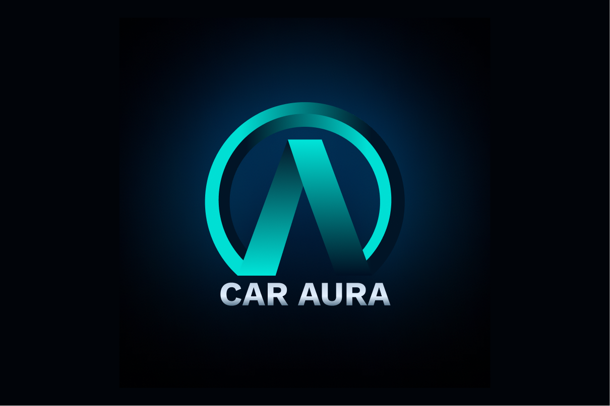

# 🚗 CarAura – Smart Vehicle Management App  

## 📌 Project Overview  
**CarAura** is an innovative mobile application designed to enhance the car ownership experience by integrating **real-time diagnostics, energy efficiency insights, smart parking assistance, and safety features**. It provides a seamless, AI-powered solution for both **electric and conventional vehicles**, ensuring a **smarter, safer, and more sustainable** driving experience.  

## 🔹 Key Features  
- **📊 Home Dashboard:** Quick vehicle health insights, real-time tracking, and driver well-being monitoring.  
- **🚦 Drive Mode:** Smart navigation, eco-driving tips, and parking assistance.  
- **🛠️ Diagnostics:** AI-powered maintenance predictions and service scheduling.  
- **🌿 Eco Mode:** Real-time energy tracking, V2G (Vehicle-to-Grid) integration, and efficiency optimization.  
- **🆘 Safety & Emergency:** AI-based accident detection, emergency alerts, and insurance claim support.  

## 🎨 UI/UX & Design  
- Designed an **intuitive and user-friendly interface** to enhance user experience.  
- Developed a **visually appealing logo** and app design to maintain brand consistency.  

## 🚀 Tech Stack  
- **Frontend:** Flutter (Dart)  
- **Backend:** Node.js, Firebase  
- **AI/ML:** TensorFlow Lite (for predictive analytics)  
- **APIs:** Google Maps, OpenWeather, Vehicle Sensors  

## 🎖️ Achievements  
- Successfully **cracked Round 1** of **i.mobilothon 4.0** organized by **Volkswagen Group Technology Solutions India**.  
- Developed a **working prototype** in the competition’s **Prototype Round**.  

## 📌 Future Enhancements  
- **Integration with OBD-II sensors** for real-time vehicle diagnostics.  
- **Personalized driving behavior analytics** using AI.  
- **Blockchain-based vehicle service records** for enhanced security.  

## 📷 Screenshots & UI/UX Design  

 
